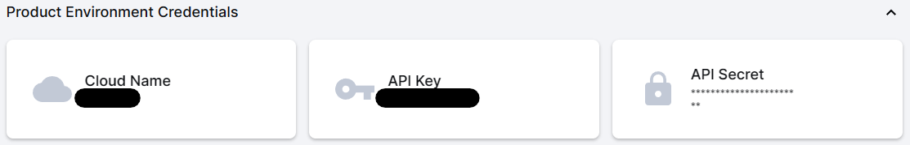

# Como configurar o Cloudinary para armazenar imagens

1. Criar uma conta no site do [Cloudinary](https://cloudinary.com/)

2. Depois de criado a conta, ir em `Dashboard` e copiar (`Cloud name`) -
   (`API Key`) - (`API Secret`)



3. no arquivo `.env` adicionar as variáveis de ambiente

```env
CLOUDINARY_CLOUD_NAME=cloud_name
CLOUDINARY_API_KEY=api_key
CLOUDINARY_API_SECRET=api_secret
```
